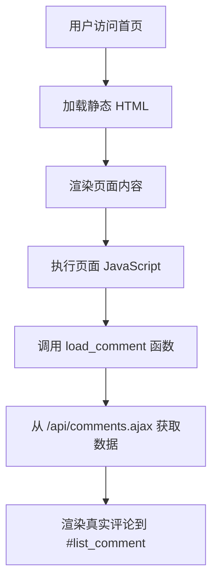

# 设计文档

## 概述

本设计将首页中的假评论数据替换为从 Supabase 数据库加载的真实数据。设计采用最小化改动原则，保持现有的 HTML 结构、样式和 JavaScript 逻辑完全不变，仅修改数据加载部分。

## 架构

### 当前架构
- 首页 (app/page.tsx) 读取静态 HTML 文件 (data/home-body.html)
- HTML 包含评论区域结构（`#list_comment`）
- HTML 中有硬编码的假评论数据
- 有评论相关的 JavaScript 函数（`load_comment`, `comment_vote`, `reply_to` 等）

### 新架构（最小改动）
- 保持首页读取静态 HTML 文件的方式不变
- 保持 HTML 结构和样式完全不变
- 修改 HTML 中的 JavaScript，使其调用真实的 API 端点
- 使用现有的 Supabase API 端点加载真实数据



## 组件和接口

### 1. 修改 HTML 文件中的 JavaScript

#### data/home-body.html（最小改动）

当前 HTML 中有以下关键元素：
- `#list_comment` - 评论列表容器
- `#comment_count` - 评论数量显示
- `load_comment()` 函数 - 加载评论的函数（当前被注释掉）
- `comment_vote()` 函数 - 评论投票函数
- `reply_to()` 函数 - 回复评论函数

需要修改的部分：
1. 删除硬编码的假评论 HTML
2. 启用 `load_comment()` 函数调用
3. 修改 `load_comment()` 函数使其调用真实 API

### 2. 使用现有 API 端点

使用现有端点：
- `/api/comments.ajax` - 获取评论列表
- `/api/make-comment.ajax` - 提交新评论
- `/api/comment-vote.ajax` - 评论投票

### 3. 数据库表

使用现有的 comments 表，无需修改：
- 表结构已完整
- 索引已创建
- RLS 策略已配置

## 数据模型

### API 响应格式
```javascript
// /api/comments.ajax 返回格式
{
  success: true,
  comments: [
    {
      id: 171,
      author: "Kota",
      content: "Steal a Brainrot is super addictive!",
      date: "3 day ago",
      like_count: 5,
      dislike_count: 6,
      parent_id: 0,
      replies: []
    }
  ],
  pagination: {
    page: 1,
    limit: 5,
    total: 13,
    totalPages: 3
  }
}
```

### HTML 评论结构
```html
<div id="comment_171" class="replyWrap clearAfter">
  <div class="listProfile">
    <div class="img img-thumbnail">K</div>
    <span class="user">Kota</span>
    <span class="user">3 day ago</span>
  </div>
  <div class="listContent">
    <div class="comment--content">Steal a Brainrot is super addictive!</div>
    <div class="control-action">
      <!-- 回复、点赞、点踩按钮 -->
    </div>
  </div>
</div>
```

## 错误处理

### 评论加载失败
- 显示错误消息在 `#list_comment` 中
- 保持评论表单可用
- 记录错误到控制台

### 评论提交失败
- 显示错误提示
- 保持表单数据
- 不清空输入框

## 测试策略

### 手动测试
- 访问首页验证评论从数据库加载
- 测试提交评论功能
- 测试回复功能
- 测试投票功能
- 测试分页和排序
- 验证样式保持不变

## 实现步骤

1. 修改 data/home-body.html 中的 JavaScript
   - 删除硬编码的假评论 HTML
   - 实现 `load_comment()` 函数调用 API
   - 实现评论 HTML 渲染函数
2. 测试评论加载和显示
3. 测试评论提交功能
4. 测试投票和回复功能
5. 验证所有现有样式保持不变

## 实现细节

### JavaScript 函数修改

#### load_comment 函数
```javascript
function load_comment(page, limit, sort, url, target, action) {
  const gameId = 'steal-brainrot';
  
  fetch(`/api/comments.ajax?game_id=${gameId}&page=${page}&limit=${limit}&sort=${sort}`)
    .then(response => response.json())
    .then(data => {
      if (data.success) {
        renderComments(data.comments, target);
        updatePagination(data.pagination);
        updateCommentCount(data.pagination.total);
      }
    })
    .catch(error => {
      console.error('加载评论失败:', error);
      jQuery(target).html('<p>加载评论失败，请刷新页面重试</p>');
    });
}
```

#### renderComments 函数
```javascript
function renderComments(comments, target) {
  let html = '';
  comments.forEach(comment => {
    html += generateCommentHTML(comment);
  });
  jQuery(target).html(html);
}
```

#### generateCommentHTML 函数
```javascript
function generateCommentHTML(comment) {
  const initial = comment.author.charAt(0).toUpperCase();
  // 生成与现有结构相同的 HTML
  return `<div id="comment_${comment.id}" class="replyWrap clearAfter">...</div>`;
}
```

## 性能考虑

- 评论系统使用客户端渲染，不影响首页 SSR
- 评论数据按需加载（分页）
- 使用现有的数据库索引
- 无额外的服务器端处理

## SEO 优化

- 评论内容通过客户端加载，不影响 SEO
- 保持现有页面的 SSR 和 meta 标签
- 可选：未来考虑服务器端渲染评论以提升 SEO
